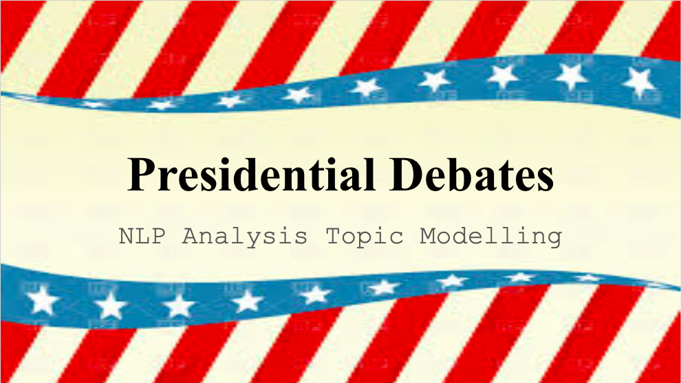

# Debates Topic Modeling

## Purpose
Over  40 years Democrats and Republicans have developed ways to reach their base with specialized language and issues. Using Machine Learning tools I analyzed Presidential Debates Transcripts and compared Democrats and Republicans when they are asked the same straight questions under the same venue and analyzed how they responded differently.

## The Data
Debates are the chosen dataset because of the common venue and equavalent time given to each topic. The pro's to this approach are the clear equivalencies both between candidates and over time. The topics even from election to election to not vary wildly. (eg. Foreign Policy will come up in every election but in different contexts). The cons the dataset is small. The topics are heavily moderated, so it is dificult for the candidates to differentiate themselves.
- The Presidential Debate Transcripts 1960-2016
Every 4 years three debates with 1 Democrat and 1 Republican presidential candidate
Nixon refused to debate 1964 and 1968  
- One Vice Presidential debate each election  
- 42 speeches total.
- 7317 spoken lines of dialogue.

## Natural Language Processing toolkits  
- NLTK - word tokenizer, stop words.
- SpaCy - tagger, parser, lemmatizer.
- Gensim - LDA Topic Modelling.
- SKLearn - Vectorizor, TFIDF
- VADER - Sentiment Analysis

## The Direct Comparison - Machine Learning Models

Presidential Debate, September 26, 2016
>CLINTON: Well, I hope the fact-checkers are turning up the volume and really working hard. Donald supported the invasion of Iraq.   
TRUMP: **Wrong.**     
CLINTON: That is absolutely proved over and over again.   
TRUMP: **Wrong. Wrong.**

Some candidates use words and lines that distinguish them and their party. The first line of attack is modelling each line of dialogue as Democrat-spoken or Republican-spoken. This is done after tokenizing and lemmatizing each speech particle and having the machine learning model pick out the meaningful differences. For example, 'abortion' and 'life' are repeated among Republicans and 'choice' is repeated more among Democrats. Using this as a baseline we can get an idea of how accurately a line selected at random can be meaningfully attributed to a Democrat or a Republican.

Logistic Regression receives the best accuracy score of:  
**68.05% Accuracy**  

We use accuracy as the metric of choice because the balance of datapoints is equivalent between the two parties so we just want to know the most informed model. The top accuracy score is 68%. Good, not great.

## The Breakdown of Topics - Gensim Topic modelling

Presidential Debate, October 7, 1984
> REAGAN: I want you to know also I will not make age an issue of this campaign. I am not going to exploit for political purposes my opponent's youth and inexperience.

Presidential Debate, October 11, 2000  
>GORE: Supporters of the Kyoto Treaty actually ended up voting for that because the way it was worded. But there’s no doubt there’s a lot of opposition to it in the Senate. I’m not for command and control techniques either. I’m for working with the groups, not just with industry but also with the citizen groups and local communities to control sprawl in ways that the local communities themselves come up with. But I disagree that we don’t know the cause of global warming. I think that we do. It’s pollution, carbon dioxide, and other chemicals that are even more potent, but in smaller quantities, that cause this. Look, the world’s temperature is going up, weather patterns are changing, storms are getting more violent and unpredictable. What are we going to tell our children? I’m a grandfather now. I want to be able to tell my grandson when I’m in my later years that I didn’t turn away from the evidence that showed that we were doing some

Presidential candidates even in a debate format will gravitate towards certain topics. We can find out what the candidates spend their time talking about by topic. For this we are using Gensim for topic modelling. Here we are letting the Machine Model pick out the topics and then condense them with human supervision.

The results, breaking down the topics into the large categories: Taxes/Economy, Abortion/Drugs/Guns/Race, Foreign Policy, Military/War, Supreme Court, Global Warming, and Thanks.  Interestingly thanks is a small (as a share of data) subset that includes "Thank you for hosting this debate." The model returns this as a significantly different whole topic.

With the model learning what topics were spoken on we can break these down by party. We get significant differences between the parties.

**Democrats**  

**Republicans**  

Democrats spoke less than Republicans overall (as a percent difference):   
**-13.525%**

Breakdown by topic by percent difference between Democrats and Republicans:  
'Court Cases: -2.6%',  
'Global Warming: 21.1%',  
'Thanks: -25.0%',  
'Taxes/Economy: -10.4%',  
'Abortion/Drugs/Race/Guns: -25.8%',  
'Foreign Policy: -15.6%',  
'Military: -14.5%']

Democrats however lead in speaking global warming and related issues with Al Gore making it a centerpiece of his campaign. However it was not just Al Gore, Jimmy Carter was an advocate in the same vein according to Gensim speaking about "conservation" and "depleting oil reserves." Even though it was a Republican, Richard Nixon, that really started environmental conservation as a political issue with the creation of the EPA, the topic has become a staple of Democratic politics. The Supreme Court is also an area favored by Democrats (even though they spoke less than Republicans on court issues, they spent more of their speaking time on it.)

Republicans lead on domestic issues, abortion, drugs, race and guns. It proved to be too much of a challenge to disaggregate these issues as they ran into one another. A candidate speaking about drugs will sometimes veer into talking about race or abortion, however it is clear from the data that Republicans favor talking about domestic ills over their Democratic rivals.

Finally, topics like war, foriegn policy, economy are evergreen. The vast majority of the debates are dominated by these topics, picked by the moderators. This includes the Vietnam War, Iraq war, China, trade policy, recessions, and whether taxes are too high. Breaking down these topics will require further drilling down to find the nuance within the umbrella of topics. We can do further analysis, looking for individual words within the topic of Military, see what kinds of words Republicans emphasize vs Democrats.

In conclusion, over time Democrats and Republicans have honed a common debate culture within their parties. We can learn broadly how different the parties are and what subjects they are more comfortable with. With more analysis we can glean even more nuance that gets lost in horse race nature of human pundits analysis.
